= Spring Platform

_Spring Boot_ multi-module _Gradle_ project.

== Modules
=== link:spring-platform-dependencies/README.adoc[Spring Platform Dependencies]

Manages shared dependency versions.

=== link:spring-platform-spring-boot-starter/README.adoc[Spring Platform Spring Boot Starter]

Provides _Spring_ default configurations.

=== link:proto/README.adoc[Proto]

Defines shared _Protocol Buffers_ (.proto) definitions.

=== link:gateway/README.adoc[Gateway]

Handles routing.

=== link:notification/README.adoc[Notification]

Manages notifications using a **3-layer architecture**.
Expose _GraphQL_ endpoint and uses MongoDB for data persistence.

=== link:storage/README.adoc[Storage]

Handles the storage, deletion, and updating of files using a **hexagonal architecture**.

== Features
=== Native images
Enable native images build by setting the native property in the `gradle.properties` file 
or running gradle command with property flag `-Pnative=true`.

=== Virtual Thread

[source,properties]
----
spring.threads.virtual.enabled=true
----

=== Security
==== RBAC
By default, _Spring_ expects roles to be prefixes with `ROLE_`.

=== Observability
https://opentelemetry.io/docs/zero-code/java/spring-boot-starter/getting-started/

== References
- https://spring.io/guides/gs/multi-module[Creating a Multi Module Gradle Project]
- https://docs.gradle.org/current/userguide/version_catalogs.html[Gradle Version Catalogs]
- https://docs.gradle.org/current/userguide/platforms.html[Gradle Platform]
- https://checkstyle.org/[Checkstyle]
- https://docs.spring.io/spring-boot/reference/actuator/tracing.html#actuator.micrometer-tracing.tracer-implementations.otel-otlp[Spring Boot Tracing]
- https://docs.spring.io/spring-boot/reference/features/spring-application.html#features.spring-application.virtual-threads[Spring Boot Virtual Threads]
- https://docs.spring.io/spring-security/reference/servlet/oauth2/resource-server/index.html[Spring Security OAuth2 Resource Server]
- https://docs.spring.io/spring-grpc/reference/index.html[Spring GRPC]
- https://docs.asciidoctor.org/[Asciidoctor Docs]
- https://mermaid.js.org/[Mermaid]