= Spring Platform Documentation

== Architecture
Diagram as Code

[shell,mermaid]
....
---
config:
  theme: default
title: Spring Platform
---
flowchart TB
    subgraph Services["Services"]
            notification["notification"]
            storage["storage"]
    end
    subgraph Backend["Backend"]
            Services
            gateway["Gateway"]
    end
    subgraph DB["DB"]
            postgres[("Postgres")]
            mongo[("MongoDB")]
    end
    subgraph Storage["Storage"]
            s3["S3"]
    end
    subgraph Workflow["Workflow"]
            temporal["temporal"]
    end
    subgraph Auth["Auth"]
            keycloak["keycloak"]
    end
    subgraph Backing["Backing"]
            DB
            Storage
            Workflow
            Auth
    end
    gateway L_gateway_Services_0@<--> Services
    storage L_storage_notification_0@-- grpc --> notification
    Backend L_Backend_Workflow_0@<-- http --> Workflow
    Backend L_Backend_DB_0@<-- tcp --> DB
    Storage L_Storage_storage_0@<-- http --> storage
    Auth L_auth_Backend_0@<-- http --> Backend
    n1["Untitled Node"] L_n1_gateway_0@<-- http  ws  graphql ---> gateway
    n1 L_n1_auth_0@<-- http --> Auth
    s3@{ shape: disk}
    n1@{ shape: sm-circ}
    L_gateway_Services_0@{ animation: fast }
    L_storage_notification_0@{ animation: fast }
    L_Backend_Workflow_0@{ animation: fast }
    L_Backend_DB_0@{ animation: fast }
    L_Storage_storage_0@{ animation: fast }
    L_auth_Backend_0@{ animation: fast }
    L_n1_gateway_0@{ animation: fast }
    L_n1_auth_0@{ animation: slow }

....

